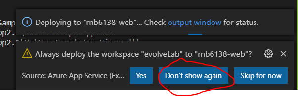

# evolveLab

Deploying an ASP.NET web application to Azure App Service.

# Instructions for Visual Studio Code

## Prequisites

> ### 1 [Install Visual Studio Code](https://code.visualstudio.com/download)

> ### 2 Add the Azure Account Extension in VS Code

> 

> [https://marketplace.visualstudio.com/items?itemName=ms-vscode.azure-account](https://marketplace.visualstudio.com/items?itemName=ms-vscode.azure-account)

> 

> [https://marketplace.visualstudio.com/items?itemName=ms-azuretools.vscode-azureappservice](https://marketplace.visualstudio.com/items?itemName=ms-azuretools.vscode-azureappservice)

## Steps 
> ### I. Clone the evolveLab

>> If you have an existing local folder for your repos change to that folder, otherwise you can create the repo at the root of &quot;C:&quot;

>> Clone the evolveLab repo using the VS Code terminal (View, Terminal) the following URL

>> [https://github.com/1scscott/evolveLab.git](https://github.com/1scscott/evolveLab.git)

>> 

> ### II. Deploy the App Service from Infrastructure as Code

>> In the VS Code terminal, set the Azure Subscription context by running:

>>>**Select-AzSubscription -Subscription &quot;eea4815d-680b-4180-91f3-da0793ee5279&quot;**

>> Run the App Service Web App deployment template using the following command.

>>> **New-AzResourceGroupDeployment -ResourceGroupName &quot;rnb6138&quot; -TemplateFile .\ArmTemplates\azuredeploy.json**

>> Replace &quot;**myResourceGroup**&quot; parameter with your ¾ ID.

>> You may use any name for the deployment, in place of &quot;**mywebapp**&quot;

>>>

>Once the command completes:

>>visit the [Azure Portal](https://portal.azure.com) to view your resources.

>>Click resource groups and filter by your ¾ ID  

> ### III. Compile the ASP .net Code
>> **Next run a build of the Dot Net version of the sample app to a folder named &quot;publish&quot; in the &quot;NetCoreSampleApp&quot; directory in the repo**

>>> dotnet publish –c Release –o ./publish

>>>

> ### IV. Deploy the ASP .net Code

>> Once the build is complete, browse to the **./evolveLab/NetCoreSampleApp/publish** folder in the VS Code folder view. Right click the publish folder and choose &quot;Deploy to Web App&quot;

>>> 

>> Select subscription '[14203-788] Public Cloud Exploration'

>>> 

>> Select your webapp identified by the name you used in Step 2 above

>>>

>> Agree to the deployment

>>> 

>> You may dismiss the Always deploy to web app message

>>> 

>> Once the deployment completes you will see a message giving you the option to browse to the deployed sample app. Click the Browse Website button.

>>> 

>> You should see the following page. Take note of the URL and copy it for use later. 

>>> 

> ### V Customize the web app code, build and deploy update

>> Open the Index.cshtml view file in the Views folder

>> Update the value for ViewData["Title"] to "Evolve Cloud Lab Home"

>> Save your changes

>>>

>> Repeat the compile steps from Section 3 above after making the change to the index file.

>> Repeat the deploy steps from Section 4 to deploy and see the new code.

# Instructions for Visual Studio Code

(In progress)

## Prequisites

(In progress)

## Steps 

(In progress)

> ### I. Clone the evolveLab

Resources

[Publish an ASP.NET Web App to Azure App Service using Visual Studio Code](https://docs.microsoft.com/en-us/aspnet/core/tutorials/publish-to-azure-webapp-using-vscode?view=aspnetcore-3.1)

[Publish an ASP.NET Web App to Azure App Service using Visual Studio](https://docs.microsoft.com/en-US/visualstudio/deployment/quickstart-deploy-to-azure?view=vs-2019)
