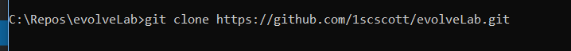
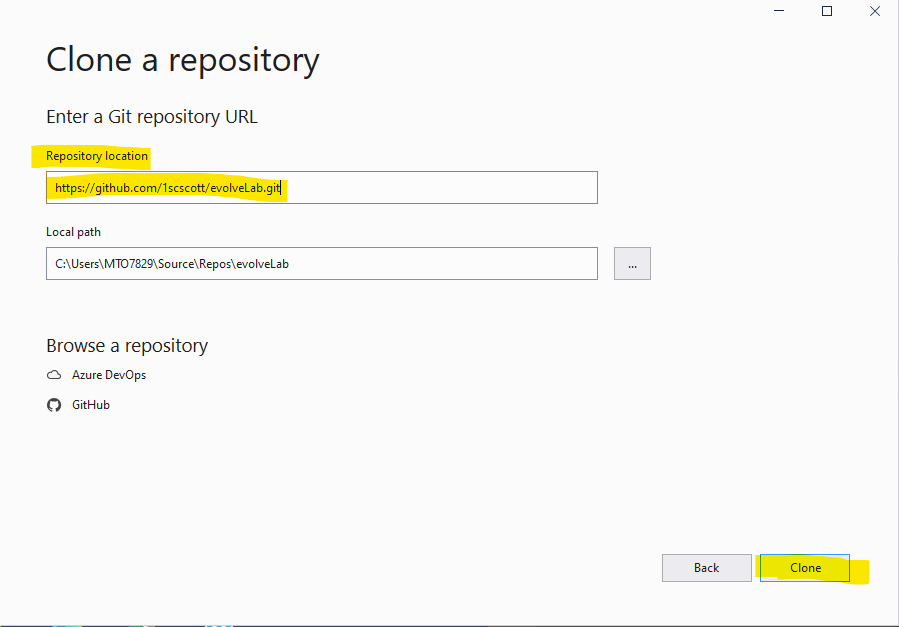
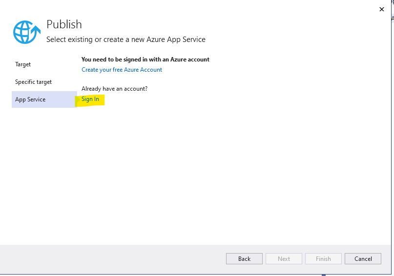

# evolveLab

Deploying an ASP.NET web application to Azure App Service.

# Instructions for Visual Studio Code

## Prequisites

> ### 1 [Install Visual Studio Code](https://code.visualstudio.com/download)

> ### 2 Add the Azure Account Extension in VS Code

> 

> [https://marketplace.visualstudio.com/items?itemName=ms-vscode.azure-account](https://marketplace.visualstudio.com/items?itemName=ms-vscode.azure-account)

> 

> [https://marketplace.visualstudio.com/items?itemName=ms-azuretools.vscode-azureappservice](https://marketplace.visualstudio.com/items?itemName=ms-azuretools.vscode-azureappservice)

## Steps 
> ### I. Clone the evolveLab

>> If you have an existing local folder for your repos change to that folder, otherwise you can create the repo at the root of &quot;C:&quot;

>> Clone the evolveLab repo using the VS Code terminal (View, Terminal) the following URL

>> [https://github.com/1scscott/evolveLab.git](https://github.com/1scscott/evolveLab.git)

>> 

> ### II. Deploy the App Service from Infrastructure as Code

>> In the VS Code terminal, set the Azure Subscription context by running:

>>>**Select-AzSubscription -Subscription &quot;eea4815d-680b-4180-91f3-da0793ee5279&quot;**

>> Run the App Service Web App deployment template using the following command.

>>> **New-AzResourceGroupDeployment -ResourceGroupName &quot;rnb6138&quot; -TemplateFile .\ArmTemplates\azuredeploy.json**

>> Replace &quot;**myResourceGroup**&quot; parameter with your ¾ ID.

>> You may use any name for the deployment, in place of &quot;**mywebapp**&quot;

>>>

>Once the command completes:

>>visit the [Azure Portal](https://portal.azure.com) to view your resources.

>>Click resource groups and filter by your ¾ ID  

> ### III. Compile the ASP .net Code
>> **Next run a build of the Dot Net version of the sample app to a folder named &quot;publish&quot; in the &quot;NetCoreSampleApp&quot; directory in the repo**

>>> dotnet publish –c Release –o ./publish

>>>

> ### IV. Deploy the ASP .net Code

>> Once the build is complete, browse to the **./evolveLab/NetCoreSampleApp/publish** folder in the VS Code folder view. Right click the publish folder and choose &quot;Deploy to Web App&quot;

>>> 

>> Select subscription '[14203-788] Public Cloud Exploration'

>>> 

>> Select your webapp identified by the name you used in Step 2 above

>>>

>> Agree to the deployment

>>> 

>> You may dismiss the Always deploy to web app message

>>> 

>> Once the deployment completes you will see a message giving you the option to browse to the deployed sample app. Click the Browse Website button.

>>> 

>> You should see the following page. Take note of the URL and copy it for use later. 

>>> 

> ### V Customize the web app code, build and deploy update

>> Open the Index.cshtml view file in the Views folder

>> Update the value for ViewData["Title"] to "Evolve Cloud Lab Home"

>> Save your changes

>>> 

>> Repeat the compile steps from Section 3 above after making the change to the index file.

>> Repeat the deploy steps from Section 4 to deploy and see the new code.

>>> 

#

# Instructions for Visual Studio Code

## Prequisites

>Visual Studio 2019 (or Visual Studio 2017) installed with the appropriate workloads:

>>ASP.NET: ASP.NET and web development(In progress)

## Steps 

> ### I. Clone the evolveLab

> 1. Open Visual Studio

> 2. Select Clone a repository from the Get Started Menu

>>> 

> 3. Enter the value 'https://github.com/1scscott/evolveLab.git' in the Repository location field

>>> 

> 4. Click the 'Clone' button

> 5. Wait for the repo to be cloned, when the 'Solution Explorer' window is opened it is done. You can also see the progress in the status bar lower left corner.

>>> 

> ### II. Deploy the App Service from Infrastructure as Code

> 1. In the 'Solution Explorer' window, right Mouse Click the 'Arm Templates' node. 

>>> 

> 2. Hover over 'Deploy' in the context menu

> 3. Select 'New...' in the sub menu

>>> 

> 4. In the Deploy to Resource Group Form

>>> a. Make sure '[14203-788] Public Cloud Lab' is selected for the 'Subscription' field

>>> b. Make sure your '3-4' is selected as in the 'Resource Group' field

>>> c. Make 'azuredeploy.json' is selectd in the 'Deployment Template' field

>>> d. Make 'azuredeploy.parameters.json' is selectd in the 'Template Parameter' field

> 5. Click Deploy

>>> The Template to create the App Service and App Service Plan you will need to deploy your application when deploying.

>>> To see the progress go to the ouput screenn and select you 3-4 in the 'Show output from:' dropdown.

>>> 

>>> The status bar will show 'Ready' in the lower left when finished.

>>> 

> 6. Visit the [Azure Portal](https://portal.azure.com) to view your resources. If prompted, Login using username <your 3-4>@hca.corpad.net and AD password.

>>> 

> 7. Click resource groups and filter by your ¾ ID  

>>> 

> 8. Click the link for your resource group named '<your 3-4>' to see your resources.

>>> 

> ### III. Compile the ASP .net Code

> 1. Open the 'Solution Explorer' window

>>> 

> 2. Right mouse click the 'NetCoreSampleApp' node and select 'Rebuild' in the context menu

>>> 

> 3. 'Rebuild All succeeded' will be displayed in the lower left corner of the status bar when complete.

> ### IV. Deploy/Publish the ASP .net Code

> 1. Right mouse click the 'NetCoreSampleApp' node and select 'Publish...' in the context menu

>>> 

> 2. In the Publish screen, click 'New' link

>>> 

> 3. Select Azure for your 'Target'

>>> 

> 4. Click Next

> 5. Select 'Azure App Service (Windows)' for your 'Specific Target'

>>> 

> 4. Click Next

> 5. Click the 'Sign In' link

>>> 

> 5. Pick option with or use your 3-4@hca.corpad.net id and use your network password to login if prompted . Skip to step 6, if the Publish dialogue is displayed.

>>> 

> 6. Select the App Service You created in Section II in the Publish Dialogue. It should have the '<your 3-4>-web'

>>> 

> 7. Click Finish to complete Publish Profile

>>> 

> 8. Click Publish to deploy the ASP.NET application

> 9. The application is successfully deployed

>>> 

> 10. You can access the web application by ctrl-clicking the link as shown in the image above, highlighted in green. Or you can open a browser and enter 'https:\\<your 3-4>-web.azurewebsites.net.

>>> 

> ### V. Customize the web app code, build and deploy update

> 1. Open the Index.cshtml view file in the Views folder

>>> 

> 2. Update the value for ViewData["Title"] to "Evolve Cloud Lab Home"

> 3. Save your changes

> 4. Deploy your changes my right mouse clicking NetCoreSampleApp project/node and selecting Publish

>>> 

> 5. Click Publish to deploy the ASP.NET application

> 9. The application is successfully deployed

>>> 

> 10. You can access the new version of the web application by ctrl-clicking the link as shown in the image above, highlighted in green. Or you can open a browser and enter 'https:\\<your 3-4>-web.azurewebsites.net.

>>> 

#

Resources

[Publish an ASP.NET Web App to Azure App Service using Visual Studio Code](https://docs.microsoft.com/en-us/aspnet/core/tutorials/publish-to-azure-webapp-using-vscode?view=aspnetcore-3.1)

[Publish an ASP.NET Web App to Azure App Service using Visual Studio](https://docs.microsoft.com/en-US/visualstudio/deployment/quickstart-deploy-to-azure?view=vs-2019)
